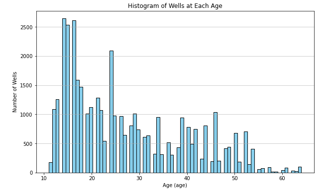
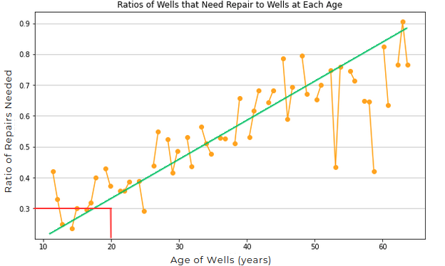

# WWFA Needs Analysis 

**Author**: [Adam Marianacci](mailto:adam.marianacci@gmail.com)

# Business Understanding

It is my job to help the WWFA (Water Wells For Africa) organization identify wells that are in need or repair in Tanzania.

# Data Understanding

The data used in this analysis comes from the Taarifa waterpoints dashboard, which aggregates data from the Tanzania Ministry of Water. The final dataframe used in this analysis contained over 38,000 entries. The dataset consisted of various information about waterwells in Tanzania such as the functioning status, water quality,  age, source, and altitude to name a few. One limitation of the dataset is that it is a fairly small since we are dealing with predictive modeling. There were also some features that would have been useful but just had too many missing values to use. Another limitation was that many of the features in the dataset were shown to have insignificant importance when it came to predicting wells that were in need of repair. The dataset was suitable for the project because it did reveal some notable features about wells. I was able to gain insight into identifying where repairs were needed to help the WWFA promote access to potable water across Tanzania.

Tanzania Ministry of Water dataset: 

# Data Preperation

In this section I checked for missing values and removed columns that I would not be needing for my analysis. I set up my 'y' value as a binary class, replacing "functional needs repair" as "needs repair. I converted the contrustion year of a well into the age of a well so that they data would be easier to work with. I one hot encoded all the categorical data I wanted to use. I set up a train, test, split on my dataframe to prepare for modeling to get results for training and testing data on my features. I scaled certain features of my data so they could be represented appropriately for visualization. I also graphed some relationships between certain features against the target variable "Needs Repair".



# Modeling 

4 models were built during this section, a baseline logistic regression model, a single deicsion tree, and 2 Random Forest Models. We got to see how well the models were performing and improved them using some hyperparameters. We also learned about the feature importances of the model and how they ranked amongst each other. Results will be explained in the evaluation section.

# Conclusions

The 'rf2' which was the 2nd Random Forest Model with hyperparameters was our best peforming model which showed a 76% macro avg. on recall. Although this wasn't a stellar score in helped to gain insights on wells that should be repaired. We need to gather more data (hundreds of thousands more entries) from features that show higher importance percentages, this will improve the predictive capabilites of our models. I found that there was a positive relationship between the ratio of wells needing repair and the age of a well. I also discovered there is generally a negative relationship between the ratio of wells needing repair and the altitude of a well from slightly below sea level to roughly 2,400 feet above sea level. I noticed after 2,400 feet the relationship changes to a positive one. More analysis needs to be conducted to draw conclusions about this relationship.



## Evaluation 

My best performing model was my rf2 model which was the second Random Forest model with hyperparameters. It showed a 76% on the macro avg. (where all classes equally contribute to the final averaged metric) of recall. Although this isn't great, it does help in identifying wells that are in need of repair. I focused on recall because it explains how many of the actual positive cases we were able to predict correctly. The confusion matrix showed that the model was falsely identifying wells 13% of the time on a sample size that was 20% of our total data. When it came to the problem of  the business understanding it was more of a concern to identify false negatives , labeling wells as not needing repair that are actually in need of repair will lead to people not having access to clean water. It showed age and gps_height as the 2 most important features with "age" as the most important feature which was different from the other models that showed gps_height as the feature of most importance. 

## Recommendations

I recommend that there should be an age threshold on waterwells that require repair/replacement of every well by the age of 20. My analysis indicates that roughly 50% of wells are in need of repairs by the age of 30. If we send repair specialists to wells starting at the age of 20 we can tackle problems before they become larger issues potenitally leaving people without clean drinking water. I also recommend we gather more data regarding population around the well. Anything mechanical undergoes 'wear and tear' the more it is used. Gathering more information on the population around the wells will show what kind of impact this has on the ratio of wells needing repair. This may also help us understand the relationship of the ratio of wells needing repairs at each altitude, since the reasons were inconclusive. Lastly I recommend gathering more data on geographic location to see what wells were not functioning because of mechanical issues and which wells were not functioning due to a lack of water supply, looking at areas susceptile to droughts would be one example of how further data would be useful to locate problem wells due to geographic location.

## Limitations

The main limitation of this dataset was that there were not many features that showed significant importance in our models. There was also a lot of missing values in the dataset, too many to the point where certain features could not be used. Also the final dataframe used consisted of only 38,000 entries, gathering 10x more data on features with greater importance to our target variable will improve our model.

## Next Steps 

We need to start making repairs mandatory and start replacing wells at the age of 20. We need to look at data regarding population around the well to see if this is having an impact on the lifespan of a well. The more use the well undergoes the quicker it is likely to breakdown I suspect. Having access to this information would certainly help our model. We  also need to gather more geographic data around the wells to learn more about the reasons wells are not functioning (mechanical or geographic issues (a drought etc. causing a lack of water supply). Lastly I would like to gather data on how the well is maintained. How frequently are the wells checked to be working properly and by who? trained or untrained people? This could also have an impact on the longevity of a well. Are wells in cities looked after more than ones in rural areas? This would help in locating problem areas for repairs.

## For More Information

See the full analysis in the [Jupyter Notebook](https://github.com/adammarianacci/Waterwell_Analysis/blob/master/notebook.ipynb) or review this [presentation](https://github.com/adammarianacci/Waterwell_Analysis/blob/master/presentation.pdf).

For additional info, contact Adam Marianacci (mailto:adam.marianacci@gmail.com)


## Repository Structure

```
├── data
├── images
├── README.md
├── presentation.pdf
└── notebook.ipynb
```